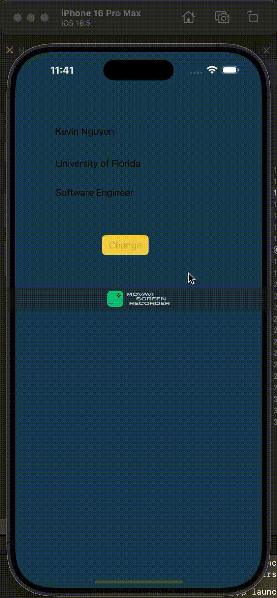

# Prework - *Tap My Color*

Submitted by: **Kevin Nguyen**

**Tap My Color** is an app that displays labels with my name, university, and title, and includes a button that changes the background color of the screen when tapped. 

Time spent: **1** hour spent in total

## Required Features

The following **required** functionality is completed:

- [ ] Users are see a screen with three labels and a button
- [ ] Tapping the button changes the screen color to a random color
 
## Video Walkthrough

## App Brainstorming (Step 4)

### My Favorite Applications & Features

1.  **Spotify**
    * **Blend Playlists** - Automatically merges musical tastes with a friend into a shared playlist.
    * **Real-time Synced Lyrics** - Displays lyrics that scroll along with the song playing.
    * **Group Session** - Allows friends to listen to the same music or podcast simultaneously, controlling playback together remotely.
2.  **Discord**
    * **Server Activities** - Embedded apps/games (like Watch Together, Putt Party) usable directly within voice channels.
    * **Stage & Forum Channels** - Specialized channel types for moderated talks (Stage) or organized, persistent topic threads (Forum).
    * **Deep Bot Integration** - The wide variety and power of community-made bots for moderation, utility, games, etc.
3.  **Strava**
    * **Flyover** - Animated 3D map video replay of your recorded activity route.
    * **Personal Heatmaps** - Visualizing the routes and areas you've covered most frequently over time.
    * **Beacon** - Live location sharing with designated safety contacts during an activity.
    
### My App Idea

My app idea, aims to assist elderly individuals, particularly immigrants who may not read English, in understanding their prescription medications independently. I was inspired by wanting to help my own mother manage her medications safely while I'm away at college. The app would use the phone's camera and computer vision (OCR) to scan the text on a prescription bottle label, identify the medication's name, and look up its purpose using reliable online drug information sources. Key features would include: 

1) **Scanning and Recognition:** Accurately reading the medication name from the label via the camera. 
2) **Information Lookup & Translation:** Finding the medication's purpose and translating both the name and description into a user-selected language (e.g., Spanish, Vietnamese, etc.). 
3) **Accessibility Features:** Presenting the translated information clearly with options for **large text** and a **read-aloud (text-to-speech)** function in the chosen language.

## Notes

My main challenge was getting familiar with the Xcode layout, as I sometimes struggled to find specific panels or options like the simulator list. Understanding the interface and actions like Control+Drag were important steps for me in this prework.

## License

    Copyright [2025] [Kevin Nguyen]

    Licensed under the Apache License, Version 2.0 (the "License");
    you may not use this file except in compliance with the License.
    You may obtain a copy of the License at

        http://www.apache.org/licenses/LICENSE-2.0

    Unless required by applicable law or agreed to in writing, software
    distributed under the License is distributed on an "AS IS" BASIS,
    WITHOUT WARRANTIES OR CONDITIONS OF ANY KIND, either express or implied.
    See the License for the specific language governing permissions and
    limitations under the License.
